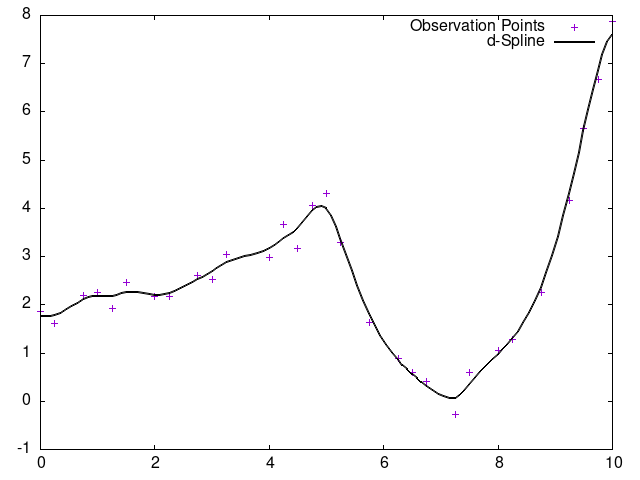

# ライブラリとしての使用方法

ライブラリとして使用する際の方法を記載する。

- [ファイル生成](#ファイル生成)
- [入力](#入力)
- [出力](#出力)
- [使用方法](#使用方法)
- [出力例](#出力例)

## ファイル生成

Makefileを使用して`make`コマンドを実行するだけで必要なファイルが生成される．

## 環境変数への追加

自動生成される `setup_env.sh` を使うと，ライブラリ使用に必要な環境変数設定が行われる．

``` bash
source setup_env.sh
```

## 入力

### 関数

本ライブラリで使用する関数は以下の通りである。

```c
ddspline(x,y,n,flag)
```

### 引数

- 第一引数 `x`  
離散点のx配列である。
- 第二引数 `y`  
離散点のy配列である。
- 第三引数 `n`  
離散点の数である。
- 第四引数 `flag`  
`flag`引数には0及び1が割り当てられている。それぞれモデルの選択を意味しており、以下の表のように0には不等間隔データに対するモデルであり、1には二相問題に対するモデルである。

| オプション名 | 内容 |  
|:-:|-|  
|`0`|不等間隔データに対するモデル|  
|`1`|二相問題に対するモデル|

## 出力

- `default.csv`  
データあてはめ前のcsvファイル
- `fitting.csv`  
データあてはめ後のcsvファイル
- `result.png`  
gnuplotを用いたデータあてはめ後のグラフ

## 使用方法

1. ユーザのメインプログラムの頭に本ライブラリである`dspline_fitting.h`を以下のように書く．

    `main.c`

    ```c
    #include <stdio.h>
    #include <stdlib.h>
    ///////

    #include "dspline_fitting.h"    //この部分を追加する

    ///////
    ```

2. あてはめを行う部分にddspline関数を記述する。記載例は以下の通りである。

    `main.c`

    ```c

    /////

    ddspline(x,y,n,flag);   

    /////
    ```

    `ddspline`関数の入力方法については[入力](#入力)を参照．

3. `-ldspline` オプションをつけてコンパイルする

    ``` bash
    gcc main.c -ldspline
    ```

## 出力例

以下のプログラムでそれぞれの出力例を示す  

`user.c`

```c
#include <stdio.h>
#include <stdlib.h>
#include "dspline_fitting.h"

int main() {
    double x[20] = {0.00, 0.55, 1.07, 1.65, 2.17, 2.66, 3.17, 3.73,4.27, 4.79, 5.33, 5.85, 6.41, 6.90, 7.44, 7.98, 8.52, 9.00, 9.48, 10.00};
    double y[20] = {2.41, 1.70, 1.97, 1.68, 2.76, 1.93, 3.73, 2.73,2.90, 4.52, 3.66, 1.47, 0.84, -0.94, 0.52, 0.13, 1.76, 4.02, 5.24, 9.45};

    int n = 20;

    dspline *result = ddspline(x, y, n, 0);

    printf("補間後のデータ:\n");
    for (int i = 0; i < result->nn; i++) {
        printf("fx[%d] = %lf, fy[%d] = %lf\n", i, result->fx[i], i, result->fy[i]);
    }

    free(result->fx);
    free(result->fy);
    free(result);

    return 0;
}
```

`result.png（option1)`



`result.png (option2)`


