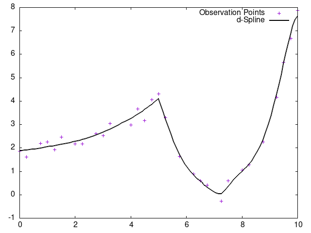

# ツールとしての使用方法

ツールとして使用する際の方法を記載する。

- [入力](#入力)
- [出力](#出力)
- [使用方法](#使用方法)
- [出力例](#出力例)

## 入力

以下の2パターンの形式どちらかでデータファイルを用意する．

- x配列とy配列を2つのファイルに分けている例  

`x配列`

``` txt
0
0.25
0.5
1
~中略~
8.75
9.0
9.5
10
```

`y配列`

``` txt
1.62
1.81
2.12
2.32
~中略~
4.54
5.78
6.52
7.91
```

- x配列とy配列を1つのファイルにしている例

```txt
0,1.864202886
0.25,1.603404302
0.75,2.188388163
1,2.264341162
~中略~
9.25,4.170648488
9.5,5.664498381
9.75,6.677234607
10,7.885698628
```

配列同士の間はカンマや空白どちらでも可。

## 出力

- `default.csv`  
データあてはめ前のcsvファイル
- `fitting.csv`  
データあてはめ後のcsvファイル
- `result.png`  
gnuplotを用いたデータあてはめ後のグラフ

## 使用方法

以下のコマンドを入力して出力を行う．  

```bash
fitting データファイルパス オプション
```

「データファイルパス」にはデータあてはめを行うデータファイル名を入力する．  
x配列とy配列を1つのファイルにしている場合は，そのファイルを指定する．

``` bash
fitting data.csv
```

x配列とy配列が別々の場合は，`x y` の順番に指定する．

``` bash
fitting x.csv y.csv
```

オプションには以下の表を参考に入力を行う．

| オプション名 | 内容 |
|-|-|
|`option1`|不等間隔データに対するモデル (デフォルト設定のため省略可)|
|`option2`|二相問題に対するモデル|

## 出力例

以下のデータファイルでそれぞれの出力例を示す

`sample.csv`

```txt
0,1.864202886
0.25,1.603404302
0.75,2.188388163
1,2.264341162
～中略～
9.25,4.170648488
9.5,5.664498381
9.75,6.677234607
10,7.885698628
```

`default.csv`

```txt
0.000000 1.864203
0.250000 1.603404
0.750000 2.188388
1.000000 2.264341
～中略～
9.250000 4.170648
9.500000 5.664498
9.750000 6.677235
10.000000 7.885699
```

`fitting.csv`

```txt
0.000000 1.760525
0.083333 1.755539
0.166667 1.757635
0.250000 1.778883
～中略～
9.750000 6.855400
9.833333 7.194727
9.916667 7.454149
10.000000 7.600462
```

`result.png（option1)`


`result.png (option2)`


